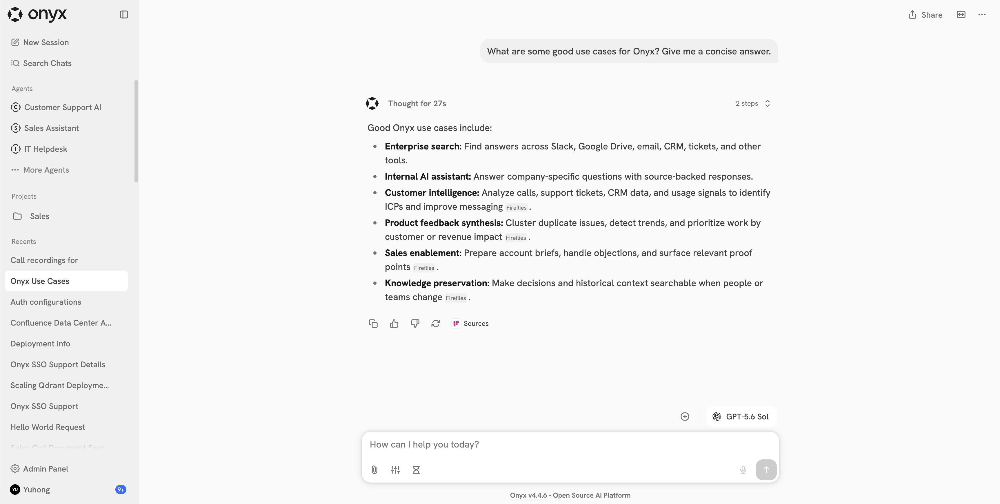
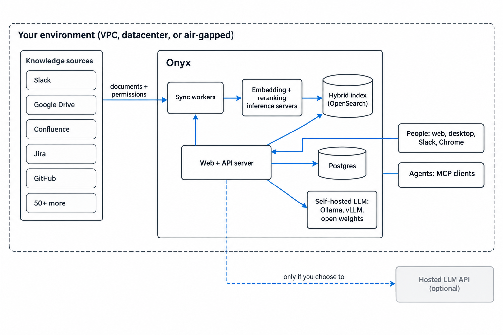

<a name="readme-top"></a>

<h2 align="center">
    <a href="https://www.onyx.app/?utm_source=onyx_repo&utm_medium=github&utm_campaign=readme"> </a>
</h2>

<p align="center">
    <a href="https://discord.gg/TDJ59cGV2X" target="_blank">
        
    </a>
    <a href="https://docs.onyx.app/?utm_source=onyx_repo&utm_medium=github&utm_campaign=readme" target="_blank">
        
    </a>
    <a href="https://www.onyx.app/?utm_source=onyx_repo&utm_medium=github&utm_campaign=readme" target="_blank">
        
    </a>
    <a href="https://github.com/onyx-dot-app/onyx/blob/main/LICENSE" target="_blank">
        
    </a>
</p>

<p align="center">
  <a href="https://trendshift.io/repositories/12516" target="_blank">
    
  </a>
</p>

# Onyx - The context layer powered by all your apps

> "LLMs know about everything public, but what if it could also know what's going on in our team? I want an AI coworker, not an AI new hire."

**[Onyx](https://www.onyx.app/?utm_source=onyx_repo&utm_medium=github&utm_campaign=readme)** is the knowledge/context layer for your team and AI agents.

Onyx connects to your application to index and surface knowledge from 50+ applications while protecting your data sovereignty through flexible self-hosted deployments.

Beyond search, Onyx enables LLMs with advanced features like web search, sandboxes, skills, and more.


> [!TIP]
> Deploy with a single command:
> ```
> curl -fsSL https://onyx.app/install_onyx.sh | bash
> ```



---

## How does Onyx work

Onyx creates a representation of knowledge across all connected sources. It pulls data along with metadata, permissions, etc. and ingests it so that the information is easily accessible for downstream use cases.

Compared to MCP based searches and index-free approaches, Onyx provides a more reliable, low latency, and low cost context for any given query whether it's a simple keyword query or a complex research task.

Instead of an agent coordinating and iteratively searching dozens of MCP and burning many thousands of tokens, Onyx fetches the context across its internal representation instantly and filters down to only the most relevant ground truth documents.

## ⭐ Features

- **🔍 Agentic RAG:** Get best in class search and answer quality based on hybrid index + a custom agent harness tuned for information retrieval.
- **🔬 Deep Research:** Get in depth reports with a multi-step research flow.
- **🤖 Custom Agents:** Build AI Agents with unique subsets of knowledge, custom instructions, and the ability to take actions.
- **🌍 Web Search:** Augment internal knowledge with live web search.
  - Supports Serper, Google PSE, Brave, SearXNG, and others.
  - Comes with an in house web crawler and support for Firecrawl/Exa.
- **▶️ External Actions & MCP:** Let Onyx agents take actions in external applications to complete tasks end to end.
- **💻 Secure Sandbox:** Execute code and work with intermediate artifacts in a sandbox for complex workflows.
- **📄 Artifacts:** Generate documents, graphics, and other downloadable artifacts.
- **🎙️ Voice Mode:** Interact with Onyx via text-to-speech and speech-to-text.

Onyx supports all major LLM providers, both self-hosted (like Ollama, LiteLLM, vLLM, etc.) and proprietary (like Anthropic, OpenAI, Gemini, etc.).

To learn more - check out our [docs](https://docs.onyx.app/welcome?utm_source=onyx_repo&utm_medium=github&utm_campaign=readme)!

---

## Security and Data Processing



When connecting up your organization's knowledge, it's critical that this sensitive IP is not leaked to the wrong parties both external and internal.

Onyx provides an air-gappable, self-hosted deployment where the document index, database, and processing all happen within a self-contained set of services.

You can also choose a trusted embedding model and LLM provider (both of which can also run locally).

---

## Access Onyx from anywhere

The same security and fine grained permissions apply no matter where the question comes from.

- **Web and desktop app** - Ask questions, interface with Onyx AI agents, and everything else in the feature list above.
- **Slack and Discord bot** - Get answers directly in Slack or Discord from a bot connected to your org's knowledge.
- **MCP server** - Point Claude Code, Open Code, Codex, or any MCP client at Onyx. Your AI agents get company context with the same access controls as the person running them.
- **Chrome extension** - Query Onyx from any tab with context from the page, directly in Chrome.
- **Embeddable Widget** - Easily add Onyx functionality to your app or website.

---

## 🚀 Deployment Modes

> Onyx supports deployments in Docker, Kubernetes, Helm/Terraform and provides guides for major cloud providers.
> Detailed deployment guides found [here](https://docs.onyx.app/deployment/overview).

Onyx supports two separate deployment options: standard and lite.

#### Standard Onyx

The complete feature set of Onyx which is recommended for serious users and larger teams. Additional components not included in Lite mode:
- Vector + Keyword index for RAG.
- Background containers to run job queues and workers for syncing knowledge from connectors.
- AI model inference servers to run deep learning models used during indexing and inference.
- Performance optimizations for large scale use via in memory cache (Redis) and blob store (MinIO).

#### Onyx Lite

The Lite mode can be thought of as a lightweight AI Chat UI. It requires less resources (under 1GB memory) and runs a less complex stack but is not capable of indexing documents.
It is great for users who want to test out the Onyx UI quickly or for teams who are only interested in the Chat UI and Agents functionalities.

> [!TIP]  
> **To try Onyx for free without deploying, visit [Onyx Cloud](https://cloud.onyx.app/signup?utm_source=onyx_repo&utm_medium=github&utm_campaign=readme)**.

---

## 🏢 Onyx for Enterprise

Onyx is built for teams of all sizes, from individual users to the largest global enterprises:
- 👥 Collaboration: Share chats and agents with other members of your organization.
- 🔐 Single Sign On: SSO via Google OAuth, OIDC, or SAML. Group syncing and user provisioning via SCIM.
- 🛡️ Role Based Access Control: RBAC for sensitive resources like access to agents, actions, etc.
- 📊 Analytics: Usage graphs broken down by teams, LLMs, or agents.
- 🕵️ Query History: Audit usage to ensure safe adoption of AI in your organization.
- 💻 Custom code: Run custom code to remove PII, reject sensitive queries, or to run custom analysis.
- 🎨 Whitelabeling: Customize the look and feel of Onyx with custom naming, icons, banners, and more.

## 📚 Licensing

There are two editions of Onyx:

- Onyx Community Edition (CE) is available freely under the MIT license and covers all of the core features for RAG, AI Chat, Agents, and Actions.
- Onyx Enterprise Edition (EE) includes extra features that are primarily useful for larger organizations.

For feature details, check out [our website](https://www.onyx.app/pricing?utm_source=onyx_repo&utm_medium=github&utm_campaign=readme).

## 👪 Community

Join our open source community on **[Discord](https://discord.gg/TDJ59cGV2X)**!

## 💡 Contributing

Looking to contribute? Please check out the [Contribution Guide](CONTRIBUTING.md) for more details.
